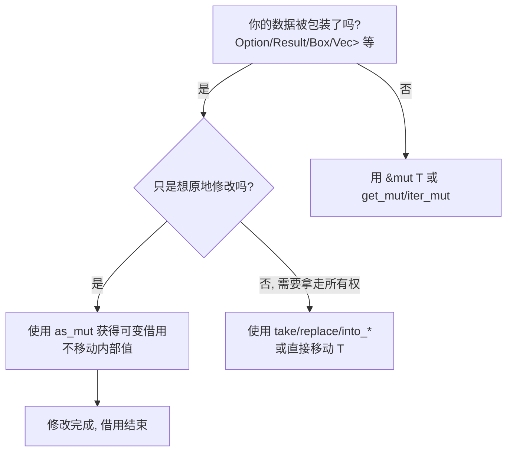

# as_mut 实用指南（通俗版）

> 核心：在不拿走所有权的前提下，获取包装类型内部值的可变引用，原地修改，避免不必要的 clone/移动。

## 何时用 as_mut？


- 关键点：`as_mut` 返回“可变引用的包装”而非移动内部值，例如 `Option<&mut T>`、`Result<&mut T, &mut E>`、`Box<T>::as_mut -> &mut T`。

## 基础示例
- Option 就地修改（避免移动）
```rust
let mut name: Option<String> = Some("tom".into());
if let Some(s) = name.as_mut() { // &mut String
    s.push_str(" cat");
}
assert_eq!(name, Some("tom cat".into()));
```

- Result 就地修改 Ok 值
```rust
fn add_one_if_ok(v: &mut Result<Vec<i32>, String>) {
    if let Ok(nums) = v.as_mut() { // &mut Vec<i32>
        nums.iter_mut().for_each(|x| *x += 1);
    }
}
```

- Box 原地修改
```rust
let mut bx = Box::new(String::from("hi"));
bx.as_mut().push('!'); // &mut String
assert_eq!(&*bx, "hi!");
```

## 组合容器中的 as_mut
- HashMap<String, Option<i32>>：先拿可变引用，再对内部 Option 使用 as_mut
```rust
use std::collections::HashMap;
let mut m: HashMap<String, Option<i32>> = HashMap::new();
m.insert("a".into(), Some(1));

if let Some(opt) = m.get_mut("a") {      // &mut Option<i32>
    if let Some(v) = opt.as_mut() {       // &mut i32
        *v += 1;
    }
}
```

- Vec<Option<T>>：遍历并就地修改存在的元素
```rust
let mut v = vec![Some(1), None, Some(3)];
for x in v.iter_mut().filter_map(|o| o.as_mut()) { // &mut i32
    *x *= 10;
}
assert_eq!(v, vec![Some(10), None, Some(30)]);
```

## 常见对照：as_mut vs 移动
```rust
let mut opt = Some(String::from("hi"));
// 错误：移动了内部值，opt 变 None
// if let Some(s) = opt { /* 使用 s */ }

// 正确：不移动，只借用可变引用
if let Some(s) = opt.as_mut() { s.push('!'); }
assert!(opt.is_some());

// 真的需要拿走所有权时：使用 take/replace
let owned = opt.take().unwrap(); // opt 现在为 None
```

## 设计建议
- 函数签名：
  - 只读：`fn f(x: &T)`；需要修改：`fn f(x: &mut T)`；需持有：`fn f(x: T)`。
  - 对包装类型参数，优先 `as_ref/as_mut` 获取借用；确需转移再 `take/into_*`。
- 性能：`as_mut` 零拷贝，减少分配与复制；仅在必须所有权时再选择移动/clone。

