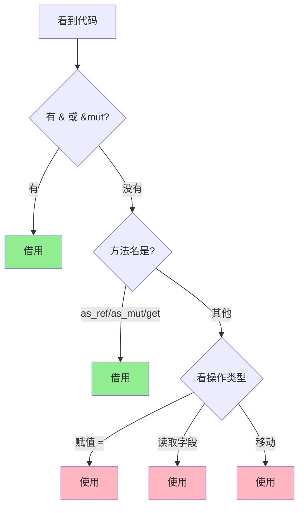
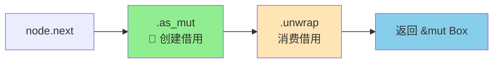
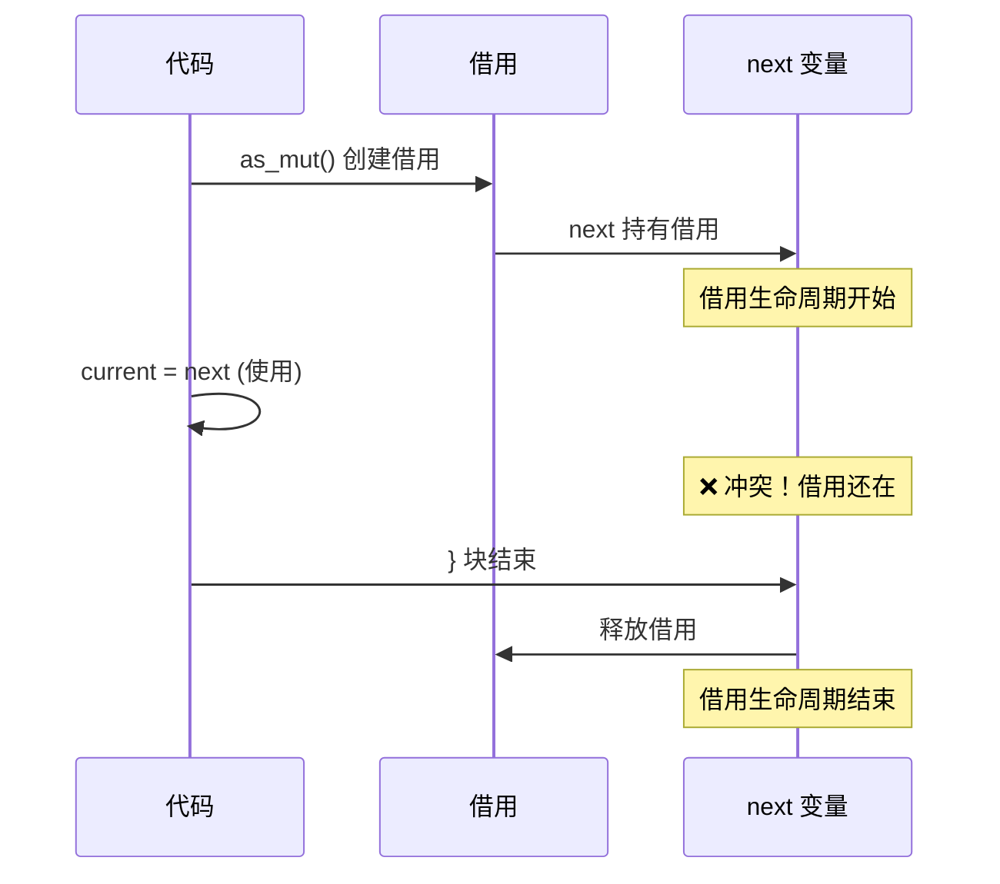
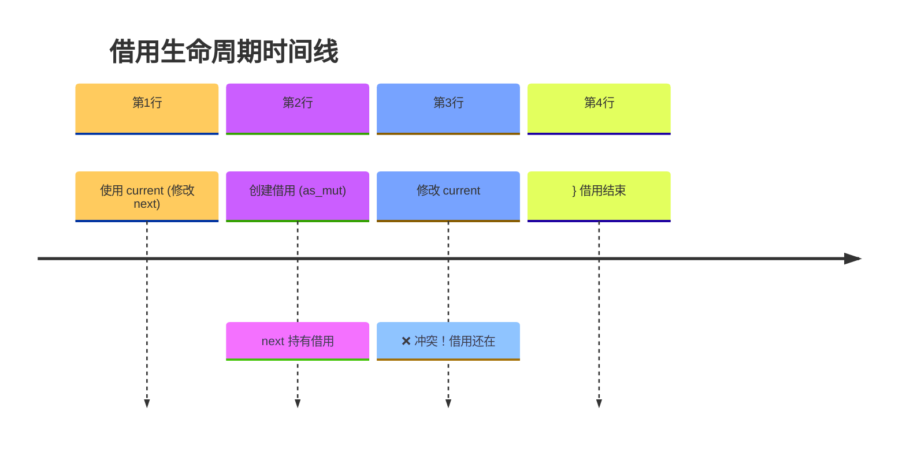
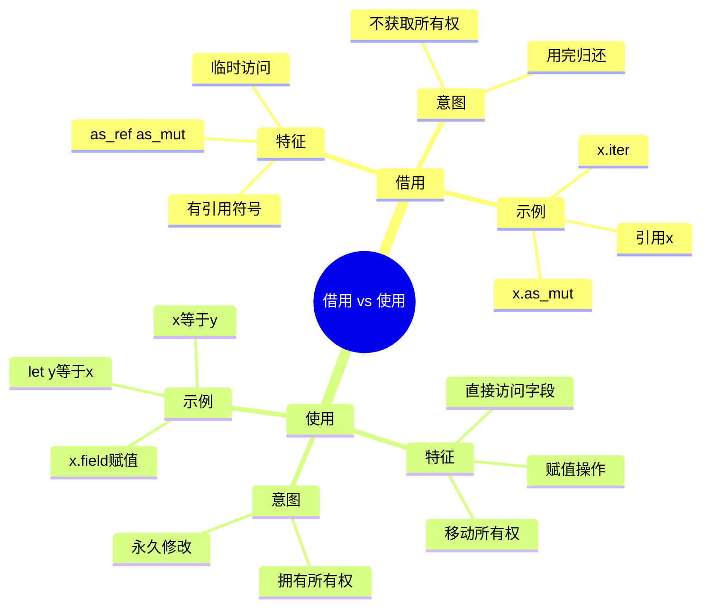

# Rust 借用 vs 使用 - 完整判断指南

## 目录
- [核心概念](#核心概念)
- [快速判断法则](#快速判断法则)
- [判断流程图](#判断流程图)
- [详细示例](#详细示例)
- [常见模式](#常见模式)
- [特殊情况](#特殊情况)
- [实战练习](#实战练习)
- [快速检查表](#快速检查表)

---

## 核心概念

### 什么是「借用」？
**借用 = 临时访问值，不获取所有权**

- 创建引用 (`&T` 或 `&mut T`)
- 临时访问，用完归还
- 不改变所有权
- 像图书馆借书

### 什么是「使用」？
**使用 = 作为所有者直接操作值**

- 拥有所有权
- 可以修改、移动、销毁
- 直接访问和操作
- 像使用自己的东西

---

## 快速判断法则

### 规则 1: 看符号

| 借用的标志 | 使用的标志 |
|-----------|-----------|
| `&` 或 `&mut` | `=` (赋值) |
| `.as_ref()` | 直接访问字段 |
| `.as_mut()` | 修改字段 |
| `.get()` | 移动所有权 |
| `.iter()` | 调用消费方法 |
| `.borrow()` | |

### 规则 2: 看类型

| 借用返回的类型 | 使用涉及的类型 |
|--------------|--------------|
| `&T` | `T` (拥有值) |
| `&mut T` | 直接操作 `T` |
| `Option<&T>` | 移动 `T` |
| `Option<&mut T>` | |

### 规则 3: 看意图

| 借用的意图 | 使用的意图 |
|----------|----------|
| 临时访问 | 拥有所有权 |
| 不改变所有权 | 移动所有权 |
| 读取或临时修改 | 永久修改 |
| 用完要还回去 | 归我所有 |

---

## 判断流程图



---

## 详细示例

### 示例 1: 明显的借用

```rust
let node = Box::new(Node::new(1));

// ✅ 借用
let r1 = &node;              // 📖 不可变借用
let r2 = &mut node;          // 📖 可变借用
```

**判断依据**: 有 `&` 符号 → 一定是借用

---

### 示例 2: 方法返回引用

```rust
// ✅ 借用
node.next.as_mut()           // 📖 借用
//        ^^^^^^^^
//        返回 Option<&mut Box<Node>>
```

**判断依据**: 方法名含 `as_ref`/`as_mut` → 借用

---

### 示例 3: 明显的使用

```rust
// ✅ 使用
node.val = 10;               // ✏️ 使用（修改字段）
let x = node;                // ✏️ 使用（移动所有权）
node.next = Some(...);       // ✏️ 使用（赋值）
```

**判断依据**: 有赋值操作 → 一定是使用

---

### 示例 4: 迭代器

```rust
let vec = vec![1, 2, 3];

// ✅ 借用
for item in &vec {           // 📖 借用
    println!("{}", item);
}

// ✅ 使用（消费）
for item in vec {            // ✏️ 使用（vec 被消费）
    println!("{}", item);
}
// vec 不再可用
```

**判断依据**: `for ... in &x` → 借用, `for ... in x` → 使用

---

### 示例 5: 方法调用

```rust
let mut s = String::from("hello");

s.len()                      // 📖 借用（&self）
s.push_str("world")          // 📖 借用（&mut self）
s.into_bytes()               // ✏️ 使用（self，消费）
```

**判断依据**: 看方法签名
- `&self` 或 `&mut self` → 借用
- `self` → 使用（消费）

---

## 常见模式

### 模式 1: 读取值

```rust
let val = node.val;          // 🔍 读取（如果是 Copy）
                            // ✏️ 使用（直接访问字段）
```

**说明**: 虽然只是读取，但仍然是「使用」，因为直接访问了 `node` 的字段

---

### 模式 2: 修改字段

```rust
node.val = 100;              // ✏️ 使用（修改）
node.next = Some(...);       // ✏️ 使用（修改）
```

**说明**: 修改字段一定是「使用」

---

### 模式 3: 获取引用

```rust
let r = &node.val;           // 📖 借用（node.val）
let r = &mut node.val;       // 📖 借用（node.val，可变）
```

**说明**: 有 `&` 符号，一定是「借用」

---

### 模式 4: 链式调用

```rust
node.next.as_mut().unwrap()
//        ^^^^^^^^  ^^^^^^^^
//        借用      消费借用
```



**说明**: `as_mut()` 借用，`unwrap()` 消费借用

---

## 特殊情况

### 特殊 1: if let / match

```rust
if let Some(next) = node.next.as_mut() {
//                  ^^^^^^^^^^^^^^^^^
//                  📖 借用
//      ^^^^
//      next 持有借用（到 } 结束）
    current = next;  // next 还持有借用
}
```

**时间线图**:



---

### 特殊 2: 闭包捕获

```rust
let closure1 = || &node;     // 📖 借用
let closure2 = || node;      // ✏️ 使用（移动）
```

---

### 特殊 3: 函数参数

```rust
fn foo(n: &Node) {}          // 📖 借用参数
fn bar(n: Node) {}           // ✏️ 使用（移动）
```

---

## 实战练习

### 练习 1: 判断以下代码

```rust
let mut data = vec![1, 2, 3];
let mut node = Box::new(Node::new(5));

// 请判断：
data.len()                   // ?
data.push(4)                 // ?
let x = data                 // ?
&x[0]                        // ?
node.next = Some(...)        // ?
node.next.as_mut()           // ?
node.next.as_mut().unwrap()  // ?
```

<details>
<summary>点击查看答案</summary>

1. `data.len()` → 📖 借用（`len()` 签名是 `&self`）
2. `data.push(4)` → 📖 借用（`push()` 签名是 `&mut self`）
3. `let x = data` → ✏️ 使用（移动所有权）
4. `&x[0]` → 📖 借用（索引返回引用）
5. `node.next = Some(...)` → ✏️ 使用（修改字段）
6. `node.next.as_mut()` → 📖 借用（返回 `Option<&mut ...>`）
7. `node.next.as_mut().unwrap()` → 📖 借用 + 立即消费

</details>

---

### 练习 2: 分析借用冲突

```rust
// 为什么这段代码有错误？
current.next = Some(Box::new(Node::new(2)));
if let Some(next) = current.next.as_mut() {
    current = next;  // ❌ 错误
}
```

<details>
<summary>点击查看分析</summary>

**借用时间线**:



**问题**:
1. 第2行: `next` 持有对 `current.next` 的借用
2. 借用生命周期: 从第2行到第4行（`}`）
3. 第3行: 试图修改 `current`
4. ❌ 冲突: 不能在借用期间修改被借用的值

**解决方案**:
```rust
current = current.next.as_mut().unwrap();
// 借用立即被消费，在一行内完成
```

</details>

---

## 快速检查表

### 代码模式判断

| 代码模式 | 借用 or 使用 |
|---------|-------------|
| `&x` 或 `&mut x` | 📖 借用 |
| `x.as_ref()` | 📖 借用 |
| `x.as_mut()` | 📖 借用 |
| `x.get(...)` | 📖 借用 |
| `x.iter()` | 📖 借用 |
| `for i in &x` | 📖 借用 |
| `x.field = ...` | ✏️ 使用 |
| `x = y` | ✏️ 使用 |
| `let y = x` | ✏️ 使用（移动） |
| `for i in x` | ✏️ 使用（消费） |
| `x.into_...()` | ✏️ 使用（消费） |

---

### 方法签名判断

| 方法签名 | 借用 or 使用 |
|---------|-------------|
| `fn foo(&self)` | 📖 借用 self |
| `fn foo(&mut self)` | 📖 借用 self |
| `fn foo(self)` | ✏️ 使用 self |
| `fn foo(x: &T)` | 📖 借用参数 |
| `fn foo(x: T)` | ✏️ 使用参数 |

---

## 记忆口诀

### 口诀 1
```
有 & 号一定借
有 = 号多半用
看方法名和类型
判断八九不离十
```

### 口诀 2
```
借用：临时看一看，用完就还原
使用：永久归我管，随便怎么玩
```

### 口诀 3
```
& 开头是借用
as_xxx 也借用
赋值修改是使用
移动所有权也用
```

---

## 核心要点总结



---

## 最后提醒

**判断三步走**:

1. **看符号**: 有 `&` → 借用
2. **看方法**: `as_xxx`、`get`、`iter` → 借用
3. **看操作**: 赋值、修改、移动 → 使用

**不确定时，看类型**:
- 返回类型有 `&` → 借用
- 返回类型是 `T` → 可能使用（移动）

**记住**:
> 借用 = 临时访问，不拥有
> 使用 = 直接操作，拥有所有权

---

## 相关资源

- [Rust 所有权详解](./所有权详解.md)
- [借用检查器工作原理](./借用检查器.md)
- [生命周期详解](./生命周期.md)
